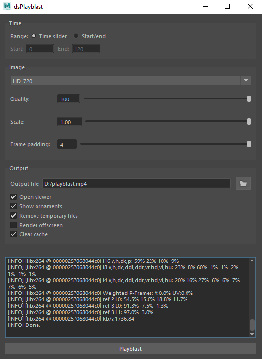

# dsPlayblast
 Playblast to mp4 using FFMPEG 



## Installation
---
- Clone repository
- If folder **qt_widgets_lib** is empty - cd your_cloned_path and run:
    ```
    git submodule init && git submodule update
    ```
- Add file **ds_playblast.mod** to **Documents/maya/modules** directory with following data:
  ```
  + ds_playblast 1.0.1 your_cloned_path/ds_playblast
  scripts: your_cloned_path/ds_playblast
  ```
## Usage
---
In Maya run the following Python command:
```python
import ds_playblast
ds_playblast.MainDialog.display()
```

## Notes
---
- Tool will use default FFMPEG executable that comes with it, although it can be overriden in **ds_playblast/config/user.json**